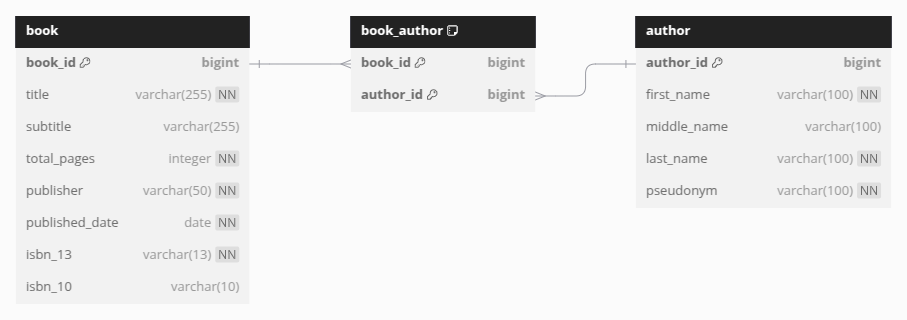

# Spring Boot CRUD

## Índice

1. [Requisitos](#requisitos)
2. [Base de datos](#base-de-datos)
3. [Endpoints](#endpoints)
4. [Construcción y ejecución](#construcción-y-ejecución)


## Requisitos

Es necesario instalar y configurar las siguientes herramientas:
- [JDK 17](https://openjdk.org/)
- [Maven](https://maven.apache.org/)
- [Git](https://git-scm.com/)
- [Docker](https://www.docker.com/)
- [Docker Compose](https://docs.docker.com/compose/)
- [Postman](https://www.postman.com/)


## Base de datos



Este proyecto utiliza [H2](https://www.h2database.com/html/main.html) como gestor de base de datos, por lo que no es necesario realizar configuraciones adicionales para su uso.


## Endpoints

### Author

| Método | Endpoint            | Descripción                             |
| ------ | ------------------- | --------------------------------------- |
| Get    | /author/findAll     | Busca todos los autores.                |
| Get    | /author/find/{id}   | Busca un autor por ID.                  |
| Post   | /author/save        | Guarda un nuevo autor.                  |
| Put    | /author/update/{id} | Actualiza un autor existente por su ID. |
| Delete | /author/delete/{id} | Elimina un autor por su ID.             |

### Book

| Método | Endpoint            | Descripción                           |
| ------ | ------------------- | ------------------------------------- |
| Get    | /book/findAll     | Busca todos los libros.                 |
| Get    | /book/find/{id}   | Busca un libro por ID.                  |
| Post   | /book/save        | Guarda un nuevo libro.                  |
| Put    | /book/update/{id} | Actualiza un libro existente por su ID. |
| Delete | /book/delete/{id} | Elimina un libro por su ID.             |

El directorio [*pm*](pm/) contiene las colecciones de Postman necesarias para probar el API.


## Construcción y ejecución

<ol>
  <li>
    Clona el repositorio:
  </li>

  ```
    git@github.com:alivro/spring-boot-crud.git
  ```

  <li>
    Cambia al directorio raíz del proyecto:
  </li>

  ```
    cd spring-boot-crud/
  ```

  <li>
    Construye la aplicación:
  </li>

  ```
    mvn clean install
  ```

  <li>
    Construye la imágen de Docker:
  </li>

  ```
    docker-compose build
  ```

  <li>
    Ejecuta la aplicación con Docker Compose:
  </li>

  ```
    docker-compose up -d
  ```
</ol>
